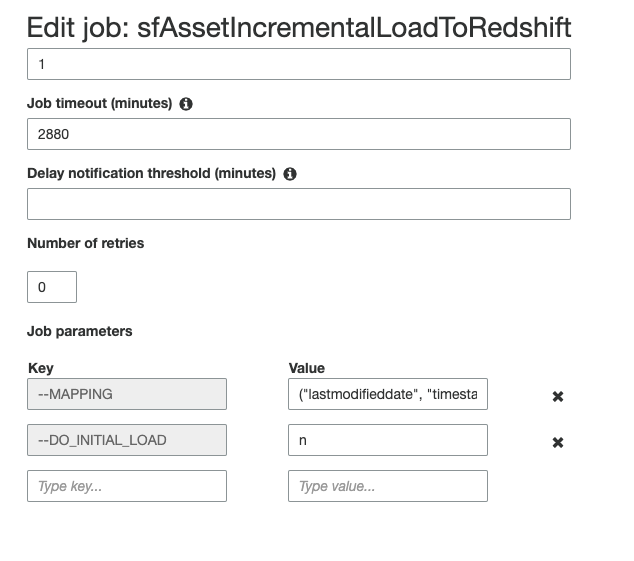

# ADDING NEW FIELD FROM SALESFORCE

## STEPS
* you have to specify params:
```
  dwhTable="sf.asset"
  sfObject="Asset"
  toS3Job="sfAssetIncrementalLoadToS3"
  toRedshiftJob="sfAssetIncrementalLoadToRedshift"
  triggerName="startAssets"
  tableName="assetincrementalload"
  databaseName="sfdb"
  crawlerName="sfAssetIncrementalLoadToS3"
```
where:
```
dwhTable - name of goal table in Redshift
sfObject - name of salesforce object to load
toS3Job - name of job loading salesforce object to S3. You can see it in workflow
toRedshiftJob - name of job loading salesforce object to Redshift. You can see it in workflow
triggerName - name of starting trigger. You can see it in workflow
tableName - name of table in Glue Data Catalog
databaseName - name of data base in Glue Data Catalog
crawlerName - name of crawler. You can see it in workflow
```
* you have to truncate goal table
```sql
truncate table sf.asset;
```
this step will be removed (TODO: do it from bash script)
* you have to add new field(s)
```sql
alter table sf.asset
add column pledgee_leased_asset_picklist__c varchar
default NULL;
```
*you have to add mapping string to MAPPING param for toRedshiftJob

for instance, before changing the MAPPING was:
```
("lastmodifieddate", "timestamp", "last_modified_date", "timestamp")
, ("made_in__c", "string", "made_in__c", "string")
, ("accountid", "string", "account_id", "string")
, ("opportunity__c", "string", "opportunity__c", "string")
, ("shorturl__c", "string", "shorturl__c", "string")
, ("name", "string", "name", "string")
, ("year__c", "string", "year__c", "string")
, ("createdbyid", "string", "created_by_id", "string")
, ("iscompetitorproduct", "boolean", "is_competitor_product", "boolean")
, ("transmission__c", "string", "transmission__c", "string")
, ("model__c", "string", "model__c", "string")
, ("status", "string", "status", "string")
, ("isdeleted", "boolean", "is_deleted", "boolean")
, ("tracker__c", "string", "tracker__c", "string")
, ("assetlevel", "int", "asset_level", "int")
, ("productcode", "string", "product_code", "string")
, ("lastvieweddate", "timestamp", "last_viewed_date", "timestamp")
, ("engine_number__c", "string", "engine_number__c", "string")
, ("quotelineitem__c", "string", "quote_line_item__c", "string")
, ("isinternal", "boolean", "is_internal", "boolean")
, ("type__c", "string", "type__c", "string")
, ("assetrelation__c", "string", "asset_relation__c", "string")
, ("serialnumber", "string", "serial_number", "string")
, ("price", "double", "price", "double")
, ("createddate", "timestamp", "created_date", "timestamp")
, ("assetservicedbyid", "string", "asset_serviced_by_id", "string")
, ("statuslock__c", "string", "status_lock__c", "string")
, ("id", "string", "id", "string")
, ("dealer_address__c", "string", "dealer_address__c", "string")
, ("cert_date__c", "date", "cert_date__c", "date")
, ("usagecitiesf__c", "string", "usage_cities_f__c", "string")
, ("description", "string", "description", "string")
, ("color__c", "string", "color__c", "string")
, ("carnumberf__c", "string", "car_number_f__c", "string")
, ("contract__c", "string", "contract__c", "string")
, ("lastreferenceddate", "timestamp", "last_referenced_date", "timestamp")
, ("stockkeepingunit", "string", "stock_keeping_unit", "string")
, ("contactid", "string", "contact_id", "string")
, ("rootassetid", "string", "root_asset_id", "string")
, ("ownerid", "string", "owner_id", "string")
, ("engine_type__c", "string", "engine_type__c", "string")
, ("statuswithdrawal__c", "string", "status_withdrawal__c", "string")
, ("cert_given_by__c", "string", "cert_given_by__c", "string")
, ("autoidentification__c", "string", "auto_identification__c"
, "string"), ("vin__c", "string", "vin__c", "string")
, ("assetprovidedbyid", "string", "asset_provided_by_id", "string")
, ("parentid", "string", "parent_id", "string")
, ("brand__c", "string", "brand__c", "string")
, ("seller__c", "string", "seller__c", "string")
, ("set__c", "string", "set__c", "string")
, ("category__c", "string", "category__c", "string")
, ("systemmodstamp", "timestamp", "system_modstamp", "timestamp")
, ("body_number__c", "string", "body_number__c", "string")
, ("engine_capacity__c", "double", "engine_capacity__c", "double")
, ("power__c", "string", "power__c", "string")
, ("product2id", "string", "product2_id", "string")
, ("cert_number__c", "string", "cert_number__c", "string")
, ("lastmodifiedbyid", "string", "last_modified_by_id", "string")
, ("xid__c", "string", "xid__c", "string")
, ("s3_load_at", "timestamp", "s3_load_at", "timestamp")
, ("year_load_at", "string", "year_load_at", "string")
, ("month_load_at", "string", "month_load_at", "string")
, ("date_load_at", "string", "date_load_at", "string")
, ("hour_load_at", "string", "hour_load_at", "string")
, ("minute_load_at", "string", "minute_load_at", "string")
```
if you add to sf objet Asset 2 new fields SourceFinancingPicklist__c and PledgeeLeasedAssetPicklist__c
you have to add to MAPPING param strings
```
, ("sourcefinancingpicklist__c", "string", "source_financing_picklist__c", "string")
, ("pledgeeleasedassetpicklist__c", "string", "pledgee_leased_asset_picklist__c", "string")
```
so the result will be
```
("lastmodifieddate", "timestamp", "last_modified_date", "timestamp")
, ("made_in__c", "string", "made_in__c", "string")
, ("accountid", "string", "account_id", "string")
, ("opportunity__c", "string", "opportunity__c", "string")
, ("shorturl__c", "string", "shorturl__c", "string")
, ("name", "string", "name", "string")
, ("year__c", "string", "year__c", "string")
, ("createdbyid", "string", "created_by_id", "string")
, ("iscompetitorproduct", "boolean", "is_competitor_product", "boolean")
, ("transmission__c", "string", "transmission__c", "string")
, ("model__c", "string", "model__c", "string")
, ("status", "string", "status", "string")
, ("isdeleted", "boolean", "is_deleted", "boolean")
, ("tracker__c", "string", "tracker__c", "string")
, ("assetlevel", "int", "asset_level", "int")
, ("productcode", "string", "product_code", "string")
, ("lastvieweddate", "timestamp", "last_viewed_date", "timestamp")
, ("engine_number__c", "string", "engine_number__c", "string")
, ("quotelineitem__c", "string", "quote_line_item__c", "string")
, ("isinternal", "boolean", "is_internal", "boolean")
, ("type__c", "string", "type__c", "string")
, ("assetrelation__c", "string", "asset_relation__c", "string")
, ("serialnumber", "string", "serial_number", "string")
, ("price", "double", "price", "double")
, ("createddate", "timestamp", "created_date", "timestamp")
, ("assetservicedbyid", "string", "asset_serviced_by_id", "string")
, ("statuslock__c", "string", "status_lock__c", "string")
, ("id", "string", "id", "string")
, ("dealer_address__c", "string", "dealer_address__c", "string")
, ("cert_date__c", "date", "cert_date__c", "date")
, ("usagecitiesf__c", "string", "usage_cities_f__c", "string")
, ("description", "string", "description", "string")
, ("color__c", "string", "color__c", "string")
, ("carnumberf__c", "string", "car_number_f__c", "string")
, ("contract__c", "string", "contract__c", "string")
, ("lastreferenceddate", "timestamp", "last_referenced_date", "timestamp")
, ("stockkeepingunit", "string", "stock_keeping_unit", "string")
, ("contactid", "string", "contact_id", "string")
, ("rootassetid", "string", "root_asset_id", "string")
, ("ownerid", "string", "owner_id", "string")
, ("engine_type__c", "string", "engine_type__c", "string")
, ("statuswithdrawal__c", "string", "status_withdrawal__c", "string")
, ("cert_given_by__c", "string", "cert_given_by__c", "string")
, ("autoidentification__c", "string", "auto_identification__c"
, "string"), ("vin__c", "string", "vin__c", "string")
, ("assetprovidedbyid", "string", "asset_provided_by_id", "string")
, ("parentid", "string", "parent_id", "string")
, ("brand__c", "string", "brand__c", "string")
, ("seller__c", "string", "seller__c", "string")
, ("set__c", "string", "set__c", "string")
, ("category__c", "string", "category__c", "string")
, ("systemmodstamp", "timestamp", "system_modstamp", "timestamp")
, ("body_number__c", "string", "body_number__c", "string")
, ("engine_capacity__c", "double", "engine_capacity__c", "double")
, ("power__c", "string", "power__c", "string")
, ("product2id", "string", "product2_id", "string")
, ("cert_number__c", "string", "cert_number__c", "string")
, ("lastmodifiedbyid", "string", "last_modified_by_id", "string")
, ("xid__c", "string", "xid__c", "string")
, ("s3_load_at", "timestamp", "s3_load_at", "timestamp")
, ("year_load_at", "string", "year_load_at", "string")
, ("month_load_at", "string", "month_load_at", "string")
, ("date_load_at", "string", "date_load_at", "string")
, ("hour_load_at", "string", "hour_load_at", "string")
, ("minute_load_at", "string", "minute_load_at", "string")
, ("sourcefinancingpicklist__c", "string", "source_financing_picklist__c", "string")
, ("pledgeeleasedassetpicklist__c", "string", "pledgee_leased_asset_picklist__c", "string")
```

### IMPORTNANT NOTE
The toS3Job and to RedshiftJob must be latest version
